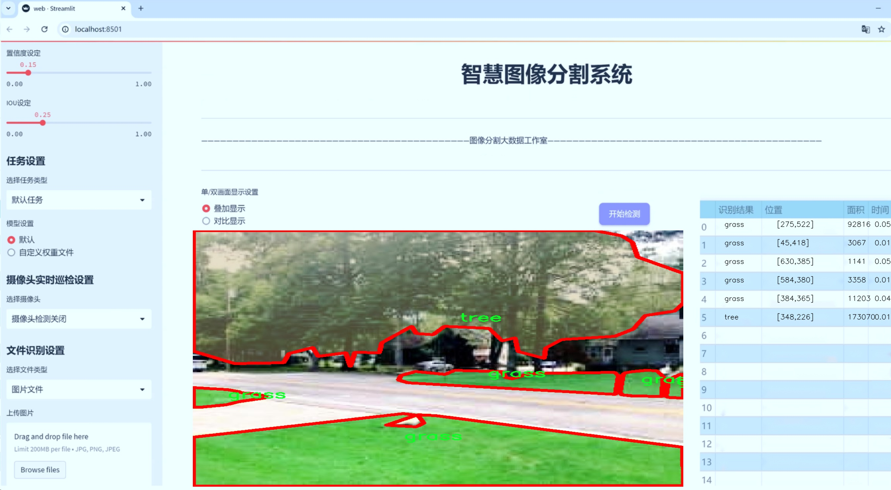
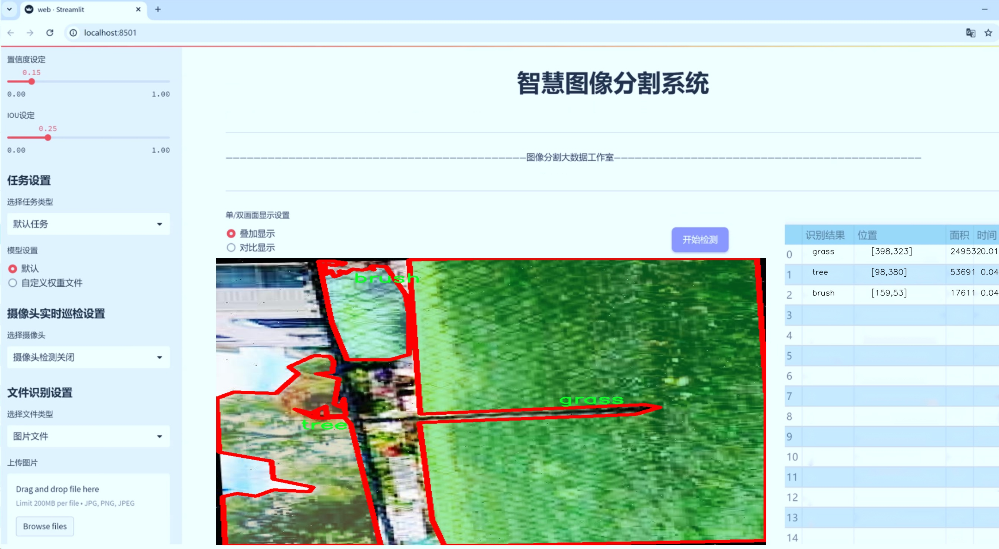
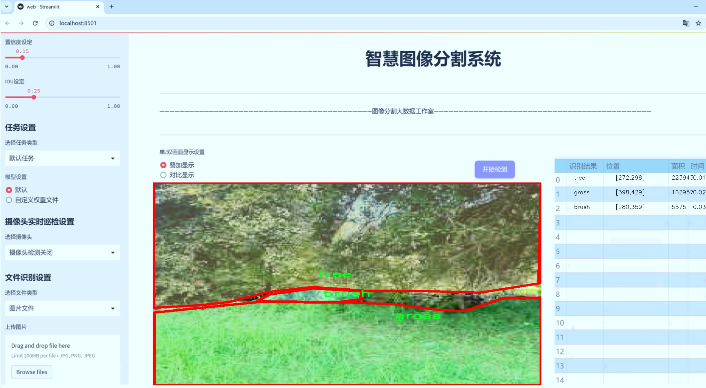
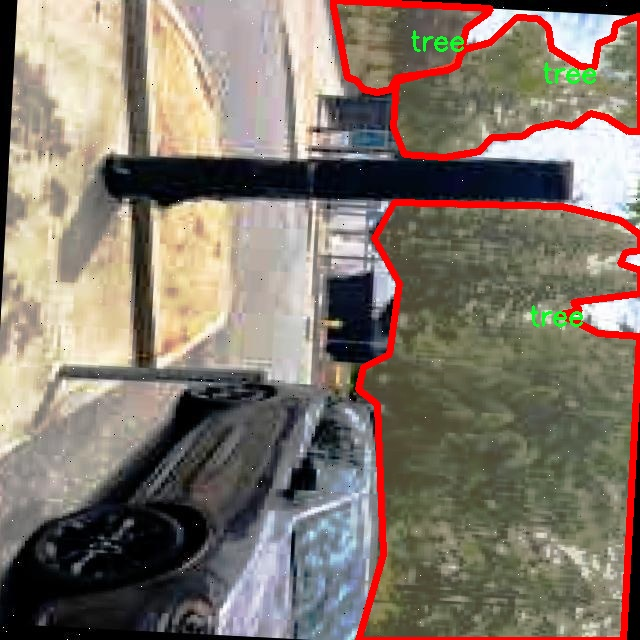
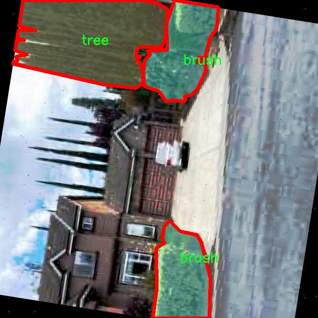
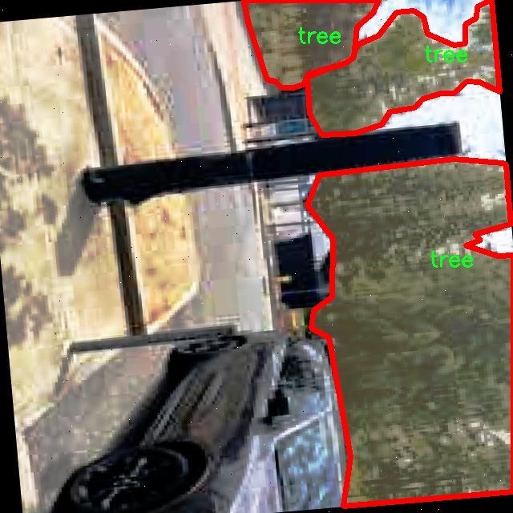
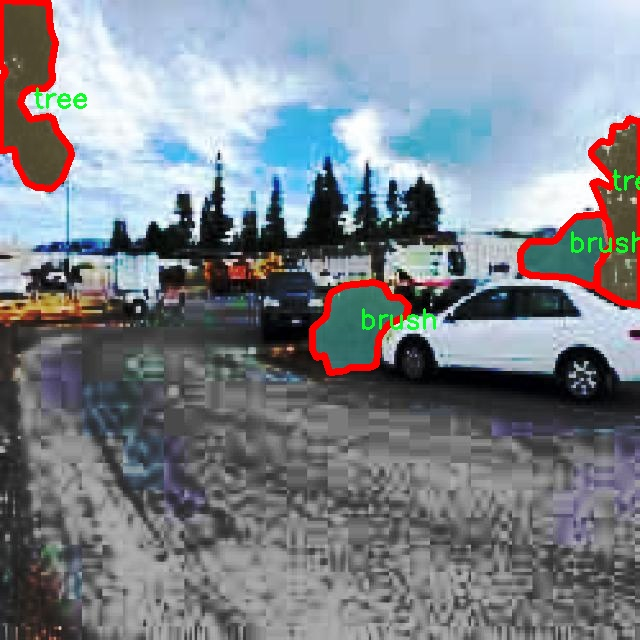
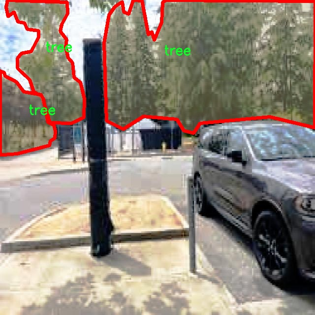

# 植被图像分割系统源码＆数据集分享
 [yolov8-seg-slimneck＆yolov8-seg-C2f-DySnakeConv等50+全套改进创新点发刊_一键训练教程_Web前端展示]

### 1.研究背景与意义

项目参考[ILSVRC ImageNet Large Scale Visual Recognition Challenge](https://gitee.com/YOLOv8_YOLOv11_Segmentation_Studio/projects)

项目来源[AAAI Global Al lnnovation Contest](https://kdocs.cn/l/cszuIiCKVNis)

研究背景与意义

随着全球气候变化和生态环境问题的日益严重，植被的监测与管理显得尤为重要。植被不仅是生态系统的重要组成部分，还在碳循环、水文循环及生物多样性保护中发挥着关键作用。因此，开发高效的植被图像分割系统，以便准确识别和分类不同类型的植被，成为了生态学、环境科学以及遥感技术等领域研究的热点之一。近年来，深度学习技术的迅猛发展为图像分割任务提供了新的解决方案，其中YOLO（You Only Look Once）系列模型因其高效性和实时性受到广泛关注。

本研究基于改进的YOLOv8模型，旨在构建一个高效的植被图像分割系统。YOLOv8作为YOLO系列的最新版本，具备更强的特征提取能力和更快的推理速度，适合处理复杂的图像分割任务。通过对YOLOv8的改进，我们希望能够进一步提升其在植被图像分割中的表现，尤其是在处理多种类植被的情况下。我们的数据集“CS-FLARE-new”包含1800张图像，涵盖了四个类别：灌木、草、落叶和树木。这些类别的选择不仅反映了植被类型的多样性，也为模型的训练和评估提供了丰富的样本。

在植被图像分割的研究中，数据集的质量和多样性是影响模型性能的关键因素。我们的数据集包含多种植被类型，能够有效地训练模型识别不同的植被特征。此外，图像数量的充足性也为模型的泛化能力提供了保障。通过对这些图像进行标注和分类，我们能够生成高质量的训练数据，从而提升模型在实际应用中的准确性和可靠性。

本研究的意义不仅在于技术上的创新，更在于其对生态环境保护的实际应用价值。通过构建高效的植被图像分割系统，我们可以实现对植被覆盖情况的实时监测，为生态环境的管理和保护提供科学依据。同时，该系统也可以应用于农业、林业等领域，帮助相关从业者进行植被健康评估和资源管理。通过对植被分布的精确识别，我们能够更好地制定生态恢复和保护策略，从而促进可持续发展。

综上所述，基于改进YOLOv8的植被图像分割系统的研究，不仅为深度学习在生态领域的应用提供了新的思路，也为生态环境保护和资源管理提供了技术支持。随着研究的深入，我们期待该系统能够在实际应用中发挥更大的作用，为应对全球生态挑战贡献力量。

### 2.图片演示







##### 注意：由于此博客编辑较早，上面“2.图片演示”和“3.视频演示”展示的系统图片或者视频可能为老版本，新版本在老版本的基础上升级如下：（实际效果以升级的新版本为准）

  （1）适配了YOLOV8的“目标检测”模型和“实例分割”模型，通过加载相应的权重（.pt）文件即可自适应加载模型。

  （2）支持“图片识别”、“视频识别”、“摄像头实时识别”三种识别模式。

  （3）支持“图片识别”、“视频识别”、“摄像头实时识别”三种识别结果保存导出，解决手动导出（容易卡顿出现爆内存）存在的问题，识别完自动保存结果并导出到tempDir中。

  （4）支持Web前端系统中的标题、背景图等自定义修改，后面提供修改教程。

  另外本项目提供训练的数据集和训练教程,暂不提供权重文件（best.pt）,需要您按照教程进行训练后实现图片演示和Web前端界面演示的效果。

### 3.视频演示

[3.1 视频演示](https://www.bilibili.com/video/BV1na2hYLEdi/)

### 4.数据集信息展示

##### 4.1 本项目数据集详细数据（类别数＆类别名）

nc: 4
names: ['brush', 'grass', 'leaf litter', 'tree']


##### 4.2 本项目数据集信息介绍

数据集信息展示

在本研究中，我们使用了名为“CS-FLARE-new”的数据集，以训练和改进YOLOv8-seg的植被图像分割系统。该数据集专门设计用于处理植被图像分割任务，具有良好的代表性和多样性，能够有效支持深度学习模型在复杂环境中的表现。数据集包含四个主要类别，分别是“brush”（灌木）、“grass”（草）、“leaf litter”（落叶）和“tree”（树木）。这些类别的选择不仅涵盖了植被的主要组成部分，还考虑到了不同生态系统中植被的多样性与复杂性。

“CS-FLARE-new”数据集的设计初衷是为了提升植被图像分割的准确性和鲁棒性。每个类别的样本均经过精心挑选，确保涵盖不同生长状态、光照条件和背景环境下的植被特征。例如，灌木类样本包括不同种类的灌木丛，草类样本则涵盖了多种草坪和野生草地的图像。落叶类别则展示了不同季节和环境下的落叶情况，而树木类别则包括了多种树种和不同生长阶段的树木图像。这种多样性使得模型在训练过程中能够学习到丰富的特征，从而提高在实际应用中的表现。

数据集的标注工作由专业的生态学家和图像处理专家共同完成，确保了标注的准确性和一致性。每张图像都经过细致的分割，确保每个类别的边界清晰可辨。这样的高质量标注为YOLOv8-seg模型的训练提供了坚实的基础，使得模型能够更好地理解和识别不同类型的植被。

在数据集的构建过程中，研究团队还特别关注了数据的平衡性。为了避免模型在训练过程中出现偏倚，数据集中的每个类别样本数量经过精心调整，确保每个类别都有足够的代表性。这种平衡不仅有助于提高模型的分类准确率，还能增强模型对不同类别的泛化能力。

此外，数据集还包含了丰富的元数据，记录了每张图像的拍摄时间、地点、天气条件等信息。这些元数据为后续的分析和研究提供了重要的背景信息，使得研究人员能够深入探讨环境因素对植被分布和生长的影响。通过结合这些信息，研究团队可以进一步优化模型，提升其在不同环境条件下的适应性。

总之，“CS-FLARE-new”数据集为本研究提供了一个高质量、丰富多样的基础，支持了YOLOv8-seg模型在植被图像分割任务中的训练与改进。通过充分利用该数据集的优势，我们期望能够实现更高效、更准确的植被分割系统，为生态监测、环境保护和资源管理等领域提供有力的技术支持。











### 5.全套项目环境部署视频教程（零基础手把手教学）

[5.1 环境部署教程链接（零基础手把手教学）](https://www.bilibili.com/video/BV1jG4Ve4E9t/?vd_source=bc9aec86d164b67a7004b996143742dc)


[5.2 安装Python虚拟环境创建和依赖库安装视频教程链接（零基础手把手教学）](https://www.bilibili.com/video/BV1nA4VeYEze/?vd_source=bc9aec86d164b67a7004b996143742dc)

### 6.手把手YOLOV8-seg训练视频教程（零基础小白有手就能学会）

[6.1 手把手YOLOV8-seg训练视频教程（零基础小白有手就能学会）](https://www.bilibili.com/video/BV1cA4VeYETe/?vd_source=bc9aec86d164b67a7004b996143742dc)


按照上面的训练视频教程链接加载项目提供的数据集，运行train.py即可开始训练



     Epoch   gpu_mem       box       obj       cls    labels  img_size
     1/200     0G   0.01576   0.01955  0.007536        22      1280: 100%|██████████| 849/849 [14:42<00:00,  1.04s/it]
               Class     Images     Labels          P          R     mAP@.5 mAP@.5:.95: 100%|██████████| 213/213 [01:14<00:00,  2.87it/s]
                 all       3395      17314      0.994      0.957      0.0957      0.0843

     Epoch   gpu_mem       box       obj       cls    labels  img_size
     2/200     0G   0.01578   0.01923  0.007006        22      1280: 100%|██████████| 849/849 [14:44<00:00,  1.04s/it]
               Class     Images     Labels          P          R     mAP@.5 mAP@.5:.95: 100%|██████████| 213/213 [01:12<00:00,  2.95it/s]
                 all       3395      17314      0.996      0.956      0.0957      0.0845

     Epoch   gpu_mem       box       obj       cls    labels  img_size
     3/200     0G   0.01561    0.0191  0.006895        27      1280: 100%|██████████| 849/849 [10:56<00:00,  1.29it/s]
               Class     Images     Labels          P          R     mAP@.5 mAP@.5:.95: 100%|███████   | 187/213 [00:52<00:00,  4.04it/s]
                 all       3395      17314      0.996      0.957      0.0957      0.0845


### 7.50+种全套YOLOV8-seg创新点代码加载调参视频教程（一键加载写好的改进模型的配置文件）

[7.1 50+种全套YOLOV8-seg创新点代码加载调参视频教程（一键加载写好的改进模型的配置文件）](https://www.bilibili.com/video/BV1Hw4VePEXv/?vd_source=bc9aec86d164b67a7004b996143742dc)

### 8.YOLOV8-seg图像分割算法原理

原始YOLOV8-seg算法原理

YOLO（You Only Look Once）系列算法自问世以来，一直在目标检测领域中占据着重要的地位。2023年，Ultralytics发布了YOLOv8，这一版本不仅延续了YOLO系列的优良传统，还在多个方面进行了创新，尤其是在分割任务上表现出色。YOLOv8-seg作为YOLOv8的一个变种，结合了高效的目标检测与图像分割能力，旨在为实时应用提供更高的精度和速度。

YOLOv8的架构由三个主要部分组成：输入端、主干网络和检测端。输入端负责接收图像数据并进行预处理，主干网络则负责特征提取，而检测端则进行目标检测和分割任务的最终输出。YOLOv8提供了多种模型版本，包括YOLOv8n、YOLOv8s、YOLOv8m、YOLOv8l和YOLOv8x，以适应不同的应用场景和计算资源。特别是YOLOv8n，作为最小的模型版本，尽管其参数量较少，但依然能够在保证精度的前提下实现快速推理。

在YOLOv8的主干网络中，采用了CSP（Cross Stage Partial）结构，这一设计使得特征提取过程更加高效。CSP结构通过将特征图分为两部分，分别进行卷积和连接，从而有效减少了计算量并提高了模型的表达能力。YOLOv8引入了C2f模块，取代了YOLOv5中的C3模块，C2f模块在设计上结合了ELAN（Efficient Layer Aggregation Network）模块的思想，增加了更多的残差连接。这种设计不仅提升了梯度信息的传递效率，还在轻量化的基础上增强了模型的特征学习能力。

在特征融合方面，YOLOv8采用了PAN-FPN（Path Aggregation Network - Feature Pyramid Network）结构。这一结构通过多尺度特征的融合，能够有效地捕捉不同尺度的目标信息，进而提高检测的准确性。PAN-FPN在YOLOv8中进一步优化了特征的上采样过程，去除了冗余的卷积操作，使得特征融合更加高效。

YOLOv8的检测端采用了解耦合头结构，这一创新使得分类和检测任务可以独立进行，从而提高了模型的灵活性和性能。同时，YOLOv8摒弃了传统的Anchor-Based检测方式，转而采用Anchor-Free的策略，这一改变使得模型在处理不同尺寸和形状的目标时更加自适应，减少了对先验框的依赖。

在训练过程中，YOLOv8引入了动态的Task-Aligned Assigner样本分配策略，优化了数据增强的过程。尤其是在训练的最后10个epoch中，关闭了马赛克增强，以避免过度增强对模型性能的负面影响。这一策略的实施使得模型在面对真实场景时，能够更好地适应各种复杂的环境变化。

损失函数的设计也是YOLOv8的一大亮点。YOLOv8采用了BCELoss（Binary Cross Entropy Loss）作为分类损失，DFLLoss（Distribution Focal Loss）和CIoULoss（Complete Intersection over Union Loss）作为回归损失。这种多样化的损失函数设计，旨在更好地平衡分类和回归任务的学习，使得模型在不同任务上都能达到较高的性能。

在应用层面，YOLOv8-seg的高效性和准确性使其在多个领域展现出广泛的应用潜力。例如，在农业领域，YOLOv8-seg可以被用于苹果的自动检测与定位，为自动采摘机器人提供视觉支持。通过结合YOLOv8的强大视觉识别能力，机器人能够快速识别成熟的苹果，并进行精准的采摘操作。

总的来说，YOLOv8-seg算法在YOLO系列的基础上，通过一系列创新和优化，提升了目标检测与分割的性能。其灵活的模型结构、有效的特征提取和融合策略、以及精心设计的损失函数，使得YOLOv8-seg在实时检测和图像分割任务中，能够实现高效、准确的结果。这些优势不仅为学术研究提供了新的思路，也为实际应用带来了切实的价值，预示着YOLOv8-seg在未来的目标检测领域将继续发挥重要作用。


### 9.系统功能展示（检测对象为举例，实际内容以本项目数据集为准）

图9.1.系统支持检测结果表格显示

  图9.2.系统支持置信度和IOU阈值手动调节

  图9.3.系统支持自定义加载权重文件best.pt(需要你通过步骤5中训练获得)

  图9.4.系统支持摄像头实时识别

  图9.5.系统支持图片识别

  图9.6.系统支持视频识别

  图9.7.系统支持识别结果文件自动保存

  图9.8.系统支持Excel导出检测结果数据


### 10.50+种全套YOLOV8-seg创新点原理讲解（非科班也可以轻松写刊发刊，V11版本正在科研待更新）

#### 10.1 由于篇幅限制，每个创新点的具体原理讲解就不一一展开，具体见下列网址中的创新点对应子项目的技术原理博客网址【Blog】：


[10.1 50+种全套YOLOV8-seg创新点原理讲解链接](https://gitee.com/qunmasj/good)

#### 10.2 部分改进模块原理讲解(完整的改进原理见上图和技术博客链接)【如果此小节的图加载失败可以通过CSDN或者Github搜索该博客的标题访问原始博客，原始博客图片显示正常】
### YOLOv8简介
YOLOv8目标检测算法继承了YOLOv1系列的思考,是一种新型端到端的目标检测算法,尽管现在原始检测算法已经开源,但是鲜有发表的相关论文.YOLOv8的网络结构如图所示,主要可分为Input输入端、Backbone骨干神经网络、Neck 混合特征网络层和Head预测层网络共4个部分.

YOLO目标检测算法是一种端到端的One-Slage 目标检测算法，其核心思想是将图像按区域分块进行预测。YOLO将输入图像按照32x32的大小划分成若干个网格，例如416x416的图像将被划分为13x13个网格。当目标物体的中心位于某个网格内时,该网格就会负责输出该物体的边界框和类别置信度。每个网格可以预测多个边界框和多个目标类别,这些边界框和类别的数量可以根据需要进行设置。YOLO算法的输出是一个特征图,包含了每个网格对应的边界框和类别置信度的信息呵。本文采用YOLO最新的YOLOv8模型，其是2022年底发布的最新YOLO系列模型，采用全新的SOTA模型，全新的网络主干结构,如图1所示。
整个网络分为Backbone 骨干网络部分和Head头部网络部分。YOLOv8汲取了前几代网络的优秀特性，骨干网络和 Neck部分遵循CSP的思想，将YOLOv5中的C3模块被替换成了梯度流更丰富C2模块,去掉YOLOv5中 PAN-FPN上采样阶段中的卷积结构,将Backbone不同阶段输出的特征直接送入了上采样操作,模型提供了N/S/M/L/X尺度的不同大小模型,能够满足不同领域业界的需求。本文基于YOLOv8模型设计番茄病虫害检测系统，通过配置模型参数训练番茄图像,得到能够用于部署应用的最优模型。


### 感受野注意力卷积（RFAConv)
#### 标准卷积操作回顾
标准的卷积操作是构造卷积神经网络的基本构件。它利用具有共享参数的滑动窗口提取特征信息，克服了全连通层构造神经网络固有的参数多、计算开销大的问题。设 X R∈C×H×W
表示输入特征图，其中C、H、W分别表示特征图的通道数、高度、宽度。为了清楚地演示卷积核的特征提取过程，我们使用 C = 1 的例子。从每个接受域滑块中提取特征信息的卷积运算可以表示为:


这里，Fi 表示计算后每个卷积滑块得到的值，Xi 表示每个滑块内对应位置的像素值，K表示卷积核，S表示卷积核中的参数个数，N表示接收域滑块的总数。可以看出，每个滑块内相同位置的 feature共享相同的参数Ki。因此，标准的卷积运算并不能捕捉到不同位置所带来的信息差异，这最终在一定程度上限制了卷积神经网络的性能。 

#### 空间注意力回顾
目前，空间注意机制是利用学习得到的注意图来突出每个特征的重要性。与前一节类似，这里以 C=1为例。突出关键特征的空间注意机制可以简单表述为:这里，Fi 表示加权运算后得到的值。xi 和Ai 表示输入特征图和学习到的注意图在不同位置的值，N为输入特征图的高和宽的乘积，表示像素值的总数。


#### 空间注意与标准卷积运算
将注意力机制整合到卷积神经网络中，可以提高卷积神经网络的性能。通过对标准卷积运算和现有空间注意机制的研究，我们认为空间注意机制有效地克服了卷积神经网络固有的参数共享的局限性。目前卷积神经网络中最常用的核大小是 1 × 1和3 × 3。在引入空间注意机制后，提取特征的卷积操作可以是 1 × 1或3 × 3卷积操作。为了直观地展示这个过程，在 1 × 1卷积运算的前面插入了空间注意机制。通过注意图对输入特征图(Re-weight“×”)进行加权运算，最后通过 1 × 1卷积运算提取接收域的滑块特征信息。整个过程可以简单地表示如下:


 这里卷积核K仅代表一个参数值。如果取A i× ki 的值作为一种新的卷积核参数，有趣的是它解决了 1×1卷积运算提取特征时的参数共享问题。然而，关于空间注意机制的传说到此结束。当空间注意机制被插入到3×3卷积运算前面时。具体情况如下:


如上所述，如果取A的值 i × ki (4)式作为一种新的卷积核参数，完全解决了大规模卷积核的参数共享问题。然而，最重要的一点是，卷积核在提取每个接受域滑块的特征时，会共享一些特征。换句话说，每个接收域滑块内都有一个重叠。仔细分析后会发现A12= a21， a13 = a22， a15 = a24……，在这种情况下，每个滑动窗口共享空间注意力地图的权重。因此，空间注意机制没有考虑整个接受域的空间特征，不能有效地解决大规模卷积核的参数共享问题。因此，空间注意机制的有效性受到限制。 

#### 创新空间注意力和标准卷积操作
该博客提出解决了现有空间注意机制的局限性，为空间处理提供了一种创新的解决方案。受RFA的启发，一系列空间注意机制被开发出来，可以进一步提高卷积神经网络的性能。RFA可以看作是一个轻量级即插即用模块，RFA设计的卷积运算(RFAConv)可以代替标准卷积来提高卷积神经网络的性能。因此，我们预测空间注意机制与标准卷积运算的结合将继续发展，并在未来带来新的突破。
接受域空间特征:为了更好地理解接受域空间特征的概念，我们将提供相关的定义。接收域空间特征是专门为卷积核设计的，并根据核大小动态生成。如图1所示，以3×3卷积核为例。在图1中，“Spatial Feature”指的是原始的Feature map。“接受域空间特征”是空间特征变换后的特征图。

 

由不重叠的滑动窗口组成。当使用 3×3卷积内核提取特征时，接收域空间特征中的每个 3×3大小窗口代表一个接收域滑块。接受域注意卷积(RFAConv):针对接受域的空间特征，我们提出了接受域注意卷积(RFA)。该方法不仅强调了接收域滑块内不同特征的重要性，而且对接收域空间特征进行了优先排序。通过该方法，完全解决了卷积核参数共享的问题。接受域空间特征是根据卷积核的大小动态生成的，因此，RFA是卷积的固定组合，不能与卷积操作的帮助分离，卷积操作同时依赖于RFA来提高性能，因此我们提出了接受场注意卷积(RFAConv)。具有3×3大小的卷积核的RFAConv整体结构如图所示。


目前，最广泛使用的接受域特征提取方法是缓慢的。经过大量的研究，我们开发了一种快速的方法，用分组卷积来代替原来的方法。具体来说，我们利用相应大小的分组卷积来动态生成基于接受域大小的展开特征。尽管与原始的无参数方法(如PyTorch提供的nn.())相比，该方法增加了一些参数，但它的速度要快得多。注意:如前一节所述，当使用 3×3卷积内核提取特征时，接收域空间特征中的每个 3×3大小窗口表示一个接收域滑块。而利用快速分组卷积提取感受野特征后，将原始特征映射为新的特征。最近的研究表明。交互信息可以提高网络性能，如[40,41,42]所示。同样，对于RFAConv来说，通过交互接受域特征信息来学习注意图可以提高网络性能。然而，与每个接收域特征交互会导致额外的计算开销，因此为了最小化计算开销和参数的数量，我们使用AvgPool来聚合每个接收域特征的全局信息。然后，使用 1×1 组卷积操作进行信息交互。最后，我们使用softmax来强调每个特征在接受域特征中的重要性。一般情况下，RFA的计算可以表示为:


这里gi×i 表示一个大小为 i×i的分组卷积，k表示卷积核的大小，Norm表示归一化，X表示输入的特征图，F由注意图 a相乘得到 rf 与转换后的接受域空间特征 Frf。与CBAM和CA不同，RFA能够为每个接受域特征生成注意图。卷积神经网络的性能受到标准卷积操作的限制，因为卷积操作依赖于共享参数，对位置变化带来的信息差异不敏感。然而，RFAConv通过强调接收域滑块中不同特征的重要性，并对接收域空间特征进行优先级排序，可以完全解决这个问题。通过RFA得到的feature map是接受域空间特征，在“Adjust Shape”后没有重叠。因此，学习到的注意图将每个接受域滑块的特征信息聚合起来。换句话说，注意力地图不再共享在每个接受域滑块。这完全弥补了现有 CA和CBAM注意机制的不足。RFA为标准卷积内核提供了显著的好处。而在调整形状后，特征的高度和宽度是 k倍，需要进行 stride = k的k × k卷积运算来提取特征信息。RFA设计的卷积运算RFAConv为卷积带来了良好的增益，对标准卷积进行了创新。
此外，我们认为现有的空间注意机制应该优先考虑接受域空间特征，以提高网络性能。众所周知，基于自注意机制的网络模型[43,44,45]取得了很大的成功，因为它解决了卷积参数共享的问题，并对远程信息进行建模。然而，自注意机制也为模型引入了显著的计算开销和复杂性。我们认为，将现有的空间注意机制的注意力引导到接受场空间特征上，可以以类似于自我注意的方式解决长期信息的参数共享和建模问题。与自我关注相比，这种方法需要的参数和计算资源少得多。答案如下:(1)将以接收场空间特征为中心的空间注意机制与卷积相结合，消除了卷积参数共享的问题。(2)现有的空间注意机制已经考虑了远程信息，可以通过全局平均池或全局最大池的方式获取全局信息，其中明确考虑了远程信息。因此，我们设计了新的 CBAM和CA模型，称为RFCBAM和RFCA，它们专注于接受域空间特征。与RFA类似，使用最终的k × k stride = k 的卷积运算来提取特征信息。这两种新的卷积方法的具体结构如图 3所示，我们称这两种新的卷积操作为 RFCBAMConv和RFCAConv。与原来的CBAM相比，我们在RFCBAM中使用SE attention来代替CAM。因为这样可以减少计算开销。此外，在RFCBAM中，通道注意和空间注意不是分开执行的。相反，它们是同时加权的，使得每个通道获得的注意力地图是不同的。


### 11.项目核心源码讲解（再也不用担心看不懂代码逻辑）

#### 11.1 ultralytics\models\yolo\model.py

以下是对给定代码的核心部分进行提炼和详细注释的结果：

```python
# 导入所需的类和模块
from ultralytics.engine.model import Model
from ultralytics.models import yolo  # noqa
from ultralytics.nn.tasks import ClassificationModel, DetectionModel, PoseModel, SegmentationModel

class YOLO(Model):
    """YOLO (You Only Look Once) 目标检测模型类。"""

    @property
    def task_map(self):
        """将任务类型映射到相应的模型、训练器、验证器和预测器类。"""
        return {
            'classify': {  # 分类任务
                'model': ClassificationModel,  # 分类模型
                'trainer': yolo.classify.ClassificationTrainer,  # 分类训练器
                'validator': yolo.classify.ClassificationValidator,  # 分类验证器
                'predictor': yolo.classify.ClassificationPredictor,  # 分类预测器
            },
            'detect': {  # 检测任务
                'model': DetectionModel,  # 检测模型
                'trainer': yolo.detect.DetectionTrainer,  # 检测训练器
                'validator': yolo.detect.DetectionValidator,  # 检测验证器
                'predictor': yolo.detect.DetectionPredictor,  # 检测预测器
            },
            'segment': {  # 分割任务
                'model': SegmentationModel,  # 分割模型
                'trainer': yolo.segment.SegmentationTrainer,  # 分割训练器
                'validator': yolo.segment.SegmentationValidator,  # 分割验证器
                'predictor': yolo.segment.SegmentationPredictor,  # 分割预测器
            },
            'pose': {  # 姿态估计任务
                'model': PoseModel,  # 姿态模型
                'trainer': yolo.pose.PoseTrainer,  # 姿态训练器
                'validator': yolo.pose.PoseValidator,  # 姿态验证器
                'predictor': yolo.pose.PosePredictor,  # 姿态预测器
            },
        }
```

### 代码分析与注释

1. **导入模块**：
   - 从 `ultralytics.engine.model` 导入 `Model` 类，这是 YOLO 模型的基类。
   - 从 `ultralytics.models` 导入 `yolo` 模块，提供不同任务的实现。
   - 从 `ultralytics.nn.tasks` 导入各种模型类，包括分类、检测、分割和姿态估计模型。

2. **YOLO 类**：
   - 该类继承自 `Model`，用于实现 YOLO 目标检测模型的功能。

3. **task_map 属性**：
   - 这是一个属性方法，返回一个字典，映射不同的任务类型（如分类、检测、分割和姿态估计）到相应的模型、训练器、验证器和预测器类。
   - 每个任务类型的映射结构包括：
     - `model`：对应的模型类，用于处理特定任务。
     - `trainer`：对应的训练器类，用于训练模型。
     - `validator`：对应的验证器类，用于验证模型性能。
     - `predictor`：对应的预测器类，用于进行推理和预测。

通过这样的设计，YOLO 类能够灵活地支持多种计算机视觉任务，便于扩展和维护。

这个文件定义了一个名为 `YOLO` 的类，该类继承自 `Model`，主要用于实现 YOLO（You Only Look Once）目标检测模型。YOLO 是一种广泛使用的实时目标检测算法，能够在单个前向传播中同时预测多个目标的类别和位置。

在这个类中，有一个名为 `task_map` 的属性方法。这个方法返回一个字典，字典的结构将不同的任务（如分类、检测、分割和姿态估计）映射到相应的模型、训练器、验证器和预测器类。具体来说：

- 对于分类任务，映射到 `ClassificationModel` 及其对应的训练、验证和预测类。
- 对于检测任务，映射到 `DetectionModel` 及其对应的训练、验证和预测类。
- 对于分割任务，映射到 `SegmentationModel` 及其对应的训练、验证和预测类。
- 对于姿态估计任务，映射到 `PoseModel` 及其对应的训练、验证和预测类。

这种设计使得 `YOLO` 类能够灵活地支持多种计算机视觉任务，并通过简单的映射关系来调用不同的模型和工具，增强了代码的可维护性和扩展性。整体来看，这个文件为 YOLO 模型的实现提供了基础结构，便于后续的训练和推理过程。

#### 11.2 ultralytics\utils\callbacks\wb.py

以下是代码中最核心的部分，并附上详细的中文注释：

```python
# 导入必要的库
from ultralytics.utils import SETTINGS, TESTS_RUNNING
from ultralytics.utils.torch_utils import model_info_for_loggers

try:
    # 确保不是在测试环境中运行
    assert not TESTS_RUNNING  
    # 确保WandB集成已启用
    assert SETTINGS['wandb'] is True  
    import wandb as wb  # 导入WandB库

    # 确保WandB库已正确安装
    assert hasattr(wb, '__version__')  

    import numpy as np  # 导入NumPy库
    import pandas as pd  # 导入Pandas库

    _processed_plots = {}  # 用于记录已处理的图表

except (ImportError, AssertionError):
    wb = None  # 如果导入失败或断言失败，则将wb设置为None


def _custom_table(x, y, classes, title='Precision Recall Curve', x_title='Recall', y_title='Precision'):
    """
    创建并记录自定义指标可视化到wandb.plot.pr_curve。

    该函数创建一个自定义指标可视化，模仿WandB默认的精确度-召回曲线的行为，同时允许增强的自定义。
    该可视化指标对于监控模型在不同类别上的性能非常有用。

    参数:
        x (List): x轴的值；预期长度为N。
        y (List): y轴的对应值；也预期长度为N。
        classes (List): 标识每个点类别的标签；长度为N。
        title (str, optional): 图表的标题；默认为'Precision Recall Curve'。
        x_title (str, optional): x轴的标签；默认为'Recall'。
        y_title (str, optional): y轴的标签；默认为'Precision'。

    返回:
        (wandb.Object): 适合记录的wandb对象，展示了创建的指标可视化。
    """
    # 创建一个DataFrame来存储类、y值和x值
    df = pd.DataFrame({'class': classes, 'y': y, 'x': x}).round(3)
    fields = {'x': 'x', 'y': 'y', 'class': 'class'}
    string_fields = {'title': title, 'x-axis-title': x_title, 'y-axis-title': y_title}
    # 返回WandB的表格可视化对象
    return wb.plot_table('wandb/area-under-curve/v0',
                         wb.Table(dataframe=df),
                         fields=fields,
                         string_fields=string_fields)


def _plot_curve(x, y, names=None, id='precision-recall', title='Precision Recall Curve', x_title='Recall', y_title='Precision', num_x=100, only_mean=False):
    """
    记录指标曲线可视化。

    该函数根据输入数据生成指标曲线，并将可视化记录到WandB。
    曲线可以表示聚合数据（均值）或单个类别数据，具体取决于'only_mean'标志。

    参数:
        x (np.ndarray): x轴的数据点，长度为N。
        y (np.ndarray): y轴的对应数据点，形状为CxN，其中C表示类别数量。
        names (list, optional): 对应y轴数据的类别名称；长度为C。默认为空列表。
        id (str, optional): 在WandB中记录数据的唯一标识符。默认为'precision-recall'。
        title (str, optional): 可视化图表的标题。默认为'Precision Recall Curve'。
        x_title (str, optional): x轴的标签。默认为'Recall'。
        y_title (str, optional): y轴的标签。默认为'Precision'。
        num_x (int, optional): 可视化的插值数据点数量。默认为100。
        only_mean (bool, optional): 标志，指示是否仅绘制均值曲线。默认为True。

    注意:
        该函数利用'_custom_table'函数生成实际的可视化。
    """
    # 创建新的x值
    if names is None:
        names = []
    x_new = np.linspace(x[0], x[-1], num_x).round(5)  # 在x的范围内生成num_x个均匀分布的新点

    # 创建用于记录的数组
    x_log = x_new.tolist()  # 将新x值转换为列表
    y_log = np.interp(x_new, x, np.mean(y, axis=0)).round(3).tolist()  # 对y值进行插值并取均值

    if only_mean:
        # 如果仅绘制均值曲线，创建表格并记录
        table = wb.Table(data=list(zip(x_log, y_log)), columns=[x_title, y_title])
        wb.run.log({title: wb.plot.line(table, x_title, y_title, title=title)})
    else:
        # 否则，记录每个类别的曲线
        classes = ['mean'] * len(x_log)  # 创建均值类别
        for i, yi in enumerate(y):
            x_log.extend(x_new)  # 添加新的x值
            y_log.extend(np.interp(x_new, x, yi))  # 对y进行插值
            classes.extend([names[i]] * len(x_new))  # 添加类别名称
        wb.log({id: _custom_table(x_log, y_log, classes, title, x_title, y_title)}, commit=False)  # 记录可视化


def on_fit_epoch_end(trainer):
    """在每个训练周期结束时记录训练指标和模型信息。"""
    wb.run.log(trainer.metrics, step=trainer.epoch + 1)  # 记录当前周期的指标
    # 记录图表
    _log_plots(trainer.plots, step=trainer.epoch + 1)
    _log_plots(trainer.validator.plots, step=trainer.epoch + 1)
    if trainer.epoch == 0:
        # 在第一个周期记录模型信息
        wb.run.log(model_info_for_loggers(trainer), step=trainer.epoch + 1)


def on_train_end(trainer):
    """在训练结束时保存最佳模型作为工件。"""
    # 记录验证器和训练器的图表
    _log_plots(trainer.validator.plots, step=trainer.epoch + 1)
    _log_plots(trainer.plots, step=trainer.epoch + 1)
    # 创建WandB工件以保存最佳模型
    art = wb.Artifact(type='model', name=f'run_{wb.run.id}_model')
    if trainer.best.exists():
        art.add_file(trainer.best)  # 添加最佳模型文件
        wb.run.log_artifact(art, aliases=['best'])  # 记录工件
    # 记录每个曲线的可视化
    for curve_name, curve_values in zip(trainer.validator.metrics.curves, trainer.validator.metrics.curves_results):
        x, y, x_title, y_title = curve_values
        _plot_curve(
            x,
            y,
            names=list(trainer.validator.metrics.names.values()),
            id=f'curves/{curve_name}',
            title=curve_name,
            x_title=x_title,
            y_title=y_title,
        )
    wb.run.finish()  # 结束WandB运行
```

### 代码核心部分说明：
1. **WandB集成**：代码通过`wandb`库实现与WandB的集成，允许记录和可视化训练过程中的指标和图表。
2. **自定义表格和曲线绘制**：定义了`_custom_table`和`_plot_curve`函数，用于创建和记录精确度-召回曲线的可视化，帮助监控模型性能。
3. **训练过程中的回调**：定义了多个回调函数（如`on_fit_epoch_end`和`on_train_end`），在训练过程的不同阶段记录指标和图表，确保训练过程中的数据被妥善记录和可视化。

这个程序文件是用于集成WandB（Weights and Biases）工具，以便在训练YOLO模型时记录和可视化各种训练指标和曲线。首先，文件通过导入必要的库和模块来设置环境，确保在运行测试时不会记录日志，并检查WandB的集成是否启用。如果导入WandB失败或设置不正确，则将WandB对象设置为None。

文件中定义了几个主要的函数。`_custom_table`函数用于创建和记录自定义的精确度-召回曲线的可视化，允许用户对图表进行增强的自定义。它接受x轴和y轴的数据点、类标签以及图表的标题和轴标签，并返回一个适合WandB记录的对象。

`_plot_curve`函数用于生成并记录一个指标曲线的可视化。它根据输入的数据生成曲线，可以选择只绘制平均曲线或每个类的曲线。该函数会使用`_custom_table`来生成实际的可视化。

`_log_plots`函数则用于记录输入字典中的图表，如果在指定的步骤中尚未记录过，则会进行记录。

接下来的几个函数是用于在不同训练阶段触发的回调函数。`on_pretrain_routine_start`函数在预训练例程开始时初始化WandB项目。`on_fit_epoch_end`函数在每个训练周期结束时记录训练指标和模型信息。`on_train_epoch_end`函数在每个训练周期结束时记录损失和学习率，并在第一周期结束时记录图表。`on_train_end`函数在训练结束时保存最佳模型，并记录验证器的图表和曲线。

最后，程序将这些回调函数整理成一个字典，以便在WandB可用时进行调用。整个文件的目的是通过WandB提供的功能，帮助用户更好地监控和分析模型训练过程中的各种指标和可视化结果。

#### 11.3 ui.py

```python
import sys
import subprocess

def run_script(script_path):
    """
    使用当前 Python 环境运行指定的脚本。

    Args:
        script_path (str): 要运行的脚本路径

    Returns:
        None
    """
    # 获取当前 Python 解释器的路径
    python_path = sys.executable

    # 构建运行命令
    command = f'"{python_path}" -m streamlit run "{script_path}"'

    # 执行命令
    result = subprocess.run(command, shell=True)
    if result.returncode != 0:
        print("脚本运行出错。")


# 实例化并运行应用
if __name__ == "__main__":
    # 指定您的脚本路径
    script_path = "web.py"  # 这里直接指定脚本路径

    # 运行脚本
    run_script(script_path)
```

### 代码注释

1. **导入模块**：
   - `import sys`：导入系统相关的模块，用于获取当前 Python 解释器的路径。
   - `import subprocess`：导入子进程模块，用于在 Python 中执行外部命令。

2. **定义函数 `run_script`**：
   - 该函数接受一个参数 `script_path`，表示要运行的 Python 脚本的路径。
   - 函数内部首先获取当前 Python 解释器的路径，并将其存储在 `python_path` 变量中。
   - 然后构建一个命令字符串 `command`，该命令用于通过 `streamlit` 运行指定的脚本。
   - 使用 `subprocess.run` 执行构建的命令，并将 `shell` 参数设置为 `True`，以便在 shell 中运行命令。
   - 如果命令执行后返回的状态码不为 0，表示执行出错，打印错误信息。

3. **主程序入口**：
   - `if __name__ == "__main__":`：确保只有在直接运行该脚本时才会执行以下代码。
   - 指定要运行的脚本路径 `script_path`，这里直接设置为 `"web.py"`。
   - 调用 `run_script` 函数，传入脚本路径以执行该脚本。


#### 11.3 train.py

以下是经过简化并注释的核心代码部分：

```python
import os
import torch
import yaml
from ultralytics import YOLO  # 导入YOLO模型库

if __name__ == '__main__':  # 确保该模块被直接运行时才执行以下代码
    # 设置训练参数
    workers = 1  # 数据加载的工作进程数
    batch = 8  # 每个批次的样本数量
    device = "0" if torch.cuda.is_available() else "cpu"  # 判断是否使用GPU

    # 获取数据集配置文件的绝对路径
    data_path = abs_path(f'datasets/data/data.yaml', path_type='current')

    # 读取YAML文件，保持原有顺序
    with open(data_path, 'r') as file:
        data = yaml.load(file, Loader=yaml.FullLoader)

    # 修改数据集路径
    if 'train' in data and 'val' in data and 'test' in data:
        directory_path = os.path.dirname(data_path.replace(os.sep, '/'))  # 获取目录路径
        data['train'] = directory_path + '/train'  # 更新训练集路径
        data['val'] = directory_path + '/val'      # 更新验证集路径
        data['test'] = directory_path + '/test'    # 更新测试集路径

        # 将修改后的数据写回YAML文件
        with open(data_path, 'w') as file:
            yaml.safe_dump(data, file, sort_keys=False)

    # 加载YOLO模型
    model = YOLO(r"C:\codeseg\codenew\50+种YOLOv8算法改进源码大全和调试加载训练教程（非必要）\改进YOLOv8模型配置文件\yolov8-seg-C2f-Faster.yaml").load("./weights/yolov8s-seg.pt")

    # 开始训练模型
    results = model.train(
        data=data_path,  # 指定训练数据的配置文件路径
        device=device,    # 指定使用的设备
        workers=workers,  # 指定数据加载的工作进程数
        imgsz=640,        # 指定输入图像的大小为640x640
        epochs=100,       # 指定训练的轮数为100
        batch=batch,      # 指定每个批次的样本数量
    )
```

### 代码注释说明：
1. **导入必要的库**：导入`os`、`torch`、`yaml`和YOLO模型库，准备进行模型训练。
2. **设置训练参数**：定义工作进程数、批次大小和设备（GPU或CPU）。
3. **获取数据集配置文件路径**：使用`abs_path`函数获取数据集的YAML配置文件的绝对路径。
4. **读取和修改YAML文件**：读取YAML文件，更新训练、验证和测试集的路径，并将修改后的内容写回文件。
5. **加载YOLO模型**：使用指定的配置文件和权重文件加载YOLO模型。
6. **开始训练模型**：调用`model.train`方法，传入数据路径、设备、工作进程数、图像大小、训练轮数和批次大小等参数，开始模型训练。

这个程序文件 `train.py` 是用于训练 YOLO（You Only Look Once）模型的脚本，主要使用了 PyTorch 框架和 YOLOv8 模型。以下是对代码的逐行解释。

首先，程序导入了一些必要的库，包括 `os`、`torch`、`yaml` 和 `matplotlib`。其中，`ultralytics` 库提供了 YOLO 模型的实现，`QtFusion.path` 用于处理路径，`matplotlib` 则用于图形绘制。

在 `if __name__ == '__main__':` 语句下，程序确保只有在直接运行该脚本时才会执行以下代码。接下来，定义了一些训练参数，包括 `workers`（数据加载的工作进程数）、`batch`（每个批次的样本数量，默认为8）以及 `device`（用于指定训练所用的设备，如果有可用的 GPU 则使用 GPU，否则使用 CPU）。

接着，程序通过 `abs_path` 函数获取数据集配置文件 `data.yaml` 的绝对路径，并将其转换为 UNIX 风格的路径。然后，使用 `os.path.dirname` 获取该路径的目录部分。

程序随后打开 `data.yaml` 文件并读取其内容，使用 `yaml.load` 函数保持原有的顺序。接下来，检查 YAML 文件中是否包含 `train`、`val` 和 `test` 字段，如果存在，则将这些字段的路径修改为当前目录下的 `train`、`val` 和 `test` 子目录，并将修改后的内容写回到 YAML 文件中。

在加载模型部分，程序创建了一个 YOLO 模型实例，指定了模型的配置文件路径，并加载了预训练的权重文件。这里的配置文件可以根据需要选择不同的模型配置。

最后，程序调用 `model.train` 方法开始训练模型，传入了数据配置文件路径、设备、工作进程数、输入图像大小（640x640）、训练的 epoch 数（100）以及批次大小（8）等参数。训练过程将根据这些参数进行模型的训练。

整体而言，这个脚本的主要功能是配置和启动 YOLO 模型的训练过程，包括数据集的准备、模型的加载和训练参数的设置。

#### 11.4 ultralytics\utils\callbacks\tensorboard.py

以下是代码中最核心的部分，并附上详细的中文注释：

```python
# 导入必要的库和模块
from ultralytics.utils import LOGGER, SETTINGS, TESTS_RUNNING, colorstr

try:
    # 尝试导入TensorBoard的SummaryWriter
    from torch.utils.tensorboard import SummaryWriter

    # 确保当前不是在测试环境中
    assert not TESTS_RUNNING  
    # 确保TensorBoard集成已启用
    assert SETTINGS['tensorboard'] is True  
    WRITER = None  # 初始化TensorBoard的SummaryWriter实例

except (ImportError, AssertionError, TypeError):
    # 捕获导入错误、断言错误和类型错误（处理Windows中的protobuf错误）
    SummaryWriter = None


def _log_scalars(scalars, step=0):
    """将标量值记录到TensorBoard中。"""
    if WRITER:  # 如果WRITER实例存在
        for k, v in scalars.items():  # 遍历标量字典
            WRITER.add_scalar(k, v, step)  # 记录每个标量


def _log_tensorboard_graph(trainer):
    """将模型图记录到TensorBoard中。"""
    try:
        import warnings
        from ultralytics.utils.torch_utils import de_parallel, torch

        imgsz = trainer.args.imgsz  # 获取输入图像大小
        imgsz = (imgsz, imgsz) if isinstance(imgsz, int) else imgsz  # 确保图像大小为元组
        p = next(trainer.model.parameters())  # 获取模型参数以确定设备和类型
        im = torch.zeros((1, 3, *imgsz), device=p.device, dtype=p.dtype)  # 创建一个输入图像（必须为零）

        with warnings.catch_warnings():
            warnings.simplefilter('ignore', category=UserWarning)  # 忽略JIT追踪警告
            WRITER.add_graph(torch.jit.trace(de_parallel(trainer.model), im, strict=False), [])  # 记录模型图
    except Exception as e:
        LOGGER.warning(f'WARNING ⚠️ TensorBoard图形可视化失败 {e}')  # 记录警告信息


def on_pretrain_routine_start(trainer):
    """使用SummaryWriter初始化TensorBoard日志记录。"""
    if SummaryWriter:  # 如果SummaryWriter存在
        try:
            global WRITER
            WRITER = SummaryWriter(str(trainer.save_dir))  # 创建SummaryWriter实例
            prefix = colorstr('TensorBoard: ')
            LOGGER.info(f"{prefix}使用 'tensorboard --logdir {trainer.save_dir}' 启动，查看地址为 http://localhost:6006/")
        except Exception as e:
            LOGGER.warning(f'WARNING ⚠️ TensorBoard未正确初始化，未记录此次运行。 {e}')  # 记录警告信息


def on_train_start(trainer):
    """记录TensorBoard图形。"""
    if WRITER:  # 如果WRITER实例存在
        _log_tensorboard_graph(trainer)  # 记录模型图


def on_batch_end(trainer):
    """在训练批次结束时记录标量统计信息。"""
    _log_scalars(trainer.label_loss_items(trainer.tloss, prefix='train'), trainer.epoch + 1)  # 记录训练损失


def on_fit_epoch_end(trainer):
    """在训练周期结束时记录周期指标。"""
    _log_scalars(trainer.metrics, trainer.epoch + 1)  # 记录训练指标


# 定义回调函数字典，根据SummaryWriter的存在与否进行初始化
callbacks = {
    'on_pretrain_routine_start': on_pretrain_routine_start,
    'on_train_start': on_train_start,
    'on_fit_epoch_end': on_fit_epoch_end,
    'on_batch_end': on_batch_end} if SummaryWriter else {}
```

### 代码核心部分说明：
1. **导入模块**：首先导入必要的模块和工具，包括TensorBoard的SummaryWriter。
2. **异常处理**：使用try-except结构处理可能的导入错误和断言错误，确保在没有TensorBoard支持的情况下代码不会崩溃。
3. **记录标量**：定义了`_log_scalars`函数用于将训练过程中的标量数据（如损失值）记录到TensorBoard。
4. **记录模型图**：`_log_tensorboard_graph`函数用于记录模型的计算图，以便在TensorBoard中可视化。
5. **回调函数**：定义了一系列回调函数，用于在训练的不同阶段（如开始训练、每个批次结束、每个周期结束）记录数据到TensorBoard。
6. **回调字典**：根据是否成功创建SummaryWriter，初始化回调函数字典，便于在训练过程中调用。

这个程序文件是一个用于集成 TensorBoard 的回调函数模块，主要用于在训练过程中记录和可视化模型的训练状态和性能指标。文件中首先导入了一些必要的模块和工具，包括日志记录器和设置参数。它尝试从 PyTorch 的 `torch.utils.tensorboard` 导入 `SummaryWriter`，这是 TensorBoard 的核心组件，用于记录数据。如果导入失败或设置不正确，则会将 `SummaryWriter` 设置为 `None`。

接下来，定义了几个内部函数。`_log_scalars` 函数用于将标量值记录到 TensorBoard 中，它接受一个字典形式的标量数据和当前步骤作为参数。如果 `WRITER` 存在，则遍历标量字典并将每个标量值添加到 TensorBoard。

`_log_tensorboard_graph` 函数用于将模型的计算图记录到 TensorBoard。它首先获取输入图像的大小，然后创建一个全零的张量作为输入，接着使用 `torch.jit.trace` 对模型进行跟踪，并将生成的图添加到 TensorBoard。如果在这个过程中发生异常，会记录警告信息。

`on_pretrain_routine_start` 函数在训练前的例程开始时被调用，用于初始化 TensorBoard 的记录器。它会创建一个 `SummaryWriter` 实例，并记录启动信息，提示用户如何查看 TensorBoard。

`on_train_start` 函数在训练开始时被调用，用于记录模型的计算图。

`on_batch_end` 函数在每个训练批次结束时被调用，记录当前批次的标量统计信息。

`on_fit_epoch_end` 函数在每个训练周期结束时被调用，记录该周期的性能指标。

最后，程序定义了一个回调字典 `callbacks`，将上述函数与相应的事件关联起来，以便在训练过程中自动调用这些函数。如果 `SummaryWriter` 不可用，则该字典为空。这种设计使得代码结构清晰，易于扩展和维护。

#### 11.5 ultralytics\hub\auth.py

以下是经过简化和注释的核心代码部分：

```python
import requests  # 导入请求库，用于发送HTTP请求

# 定义API的根URL
HUB_API_ROOT = 'https://api.example.com'  # 示例API根URL
HUB_WEB_ROOT = 'https://web.example.com'  # 示例Web根URL
PREFIX = '[Auth]'  # 日志前缀

class Auth:
    """
    处理身份验证过程，包括API密钥管理和基于cookie的身份验证。
    """
    id_token = api_key = False  # 初始化身份令牌和API密钥为False

    def __init__(self, api_key='', verbose=False):
        """
        初始化Auth类，接受可选的API密钥。
        """
        # 处理输入的API密钥，保留API密钥部分
        api_key = api_key.split('_')[0]
        self.api_key = api_key or ''  # 如果没有提供API密钥，则为空

        # 如果提供了API密钥
        if self.api_key:
            success = self.authenticate()  # 尝试进行身份验证
        else:
            success = self.request_api_key()  # 请求用户输入API密钥

        # 如果身份验证成功，更新设置
        if success:
            print(f'{PREFIX}身份验证成功 ✅')  # 输出成功信息

    def request_api_key(self):
        """
        提示用户输入API密钥。
        """
        import getpass  # 导入用于安全输入的库
        input_key = getpass.getpass('请输入API密钥: ')  # 安全输入API密钥
        self.api_key = input_key.split('_')[0]  # 去掉模型ID部分
        return self.authenticate()  # 尝试进行身份验证

    def authenticate(self) -> bool:
        """
        尝试使用API密钥进行身份验证。
        """
        try:
            header = self.get_auth_header()  # 获取身份验证头
            if header:
                r = requests.post(f'{HUB_API_ROOT}/v1/auth', headers=header)  # 发送身份验证请求
                return r.json().get('success', False)  # 返回身份验证结果
            return False
        except Exception:
            print(f'{PREFIX}无效的API密钥 ⚠️')  # 输出警告信息
            return False

    def get_auth_header(self):
        """
        获取用于API请求的身份验证头。
        """
        if self.api_key:
            return {'x-api-key': self.api_key}  # 返回API密钥头
        return None  # 如果没有API密钥，返回None
```

### 代码说明：
1. **导入库**：导入`requests`库用于发送HTTP请求。
2. **类定义**：`Auth`类负责处理身份验证，包括API密钥的管理。
3. **初始化方法**：在初始化时，接受一个可选的API密钥，并尝试进行身份验证。
4. **请求API密钥**：如果没有提供API密钥，提示用户输入。
5. **身份验证方法**：使用API密钥向服务器发送请求以验证身份。
6. **获取身份验证头**：根据是否有API密钥返回相应的请求头。

这段代码的核心功能是处理API的身份验证，确保用户能够通过有效的API密钥进行访问。

这个程序文件是一个用于管理身份验证的类，名为 `Auth`，主要用于处理与 Ultralytics Hub 的 API 交互时的身份验证过程。它支持多种身份验证方式，包括直接使用 API 密钥、使用浏览器 Cookie 进行身份验证（特别是在 Google Colab 环境中），以及提示用户输入 API 密钥。

在类的属性中，`id_token`、`api_key` 和 `model_key` 都被初始化为 `False`，其中 `id_token` 用于身份验证，`api_key` 用于 API 访问，`model_key` 是一个占位符。构造函数 `__init__` 接受一个可选的 API 密钥参数，并在初始化时处理该密钥。如果提供了 API 密钥，它会与设置中的密钥进行比较，如果匹配则记录用户已登录的状态；如果不匹配，则尝试进行身份验证。如果没有提供 API 密钥且当前环境是 Google Colab，则尝试使用浏览器 Cookie 进行身份验证；否则，程序会请求用户输入 API 密钥。

`request_api_key` 方法用于提示用户输入 API 密钥，最多允许三次尝试。如果用户输入的密钥有效，则返回成功的状态；否则抛出连接错误。`authenticate` 方法尝试使用 `id_token` 或 API 密钥与服务器进行身份验证，成功时返回 `True`，失败时返回 `False`，并重置无效的密钥。

`auth_with_cookies` 方法专门用于在 Google Colab 环境中通过 Cookie 进行身份验证。它尝试获取浏览器的身份验证信息，并设置 `id_token`。如果成功，调用 `authenticate` 方法进行验证。最后，`get_auth_header` 方法用于生成用于 API 请求的身份验证头，如果 `id_token` 或 API 密钥已设置，则返回相应的头信息，否则返回 `None`。

整体而言，这个类的设计旨在简化与 Ultralytics Hub 的交互过程，确保用户能够方便地进行身份验证并安全地访问 API。

#### 11.6 ultralytics\models\sam\model.py

以下是代码中最核心的部分，并附上详细的中文注释：

```python
from pathlib import Path  # 导入Path类，用于处理文件路径

from ultralytics.engine.model import Model  # 从Ultralytics库导入Model基类
from ultralytics.utils.torch_utils import model_info  # 导入模型信息获取函数

from .build import build_sam  # 导入构建SAM模型的函数
from .predict import Predictor  # 导入预测器类


class SAM(Model):
    """
    SAM（Segment Anything Model）接口类。

    SAM旨在实现可提示的实时图像分割。可以使用多种提示方式，如边界框、点或标签。该模型具有零-shot性能，并在SA-1B数据集上进行训练。
    """

    def __init__(self, model='sam_b.pt') -> None:
        """
        使用预训练模型文件初始化SAM模型。

        参数：
            model (str): 预训练SAM模型文件的路径。文件应具有.pt或.pth扩展名。

        异常：
            NotImplementedError: 如果模型文件扩展名不是.pt或.pth。
        """
        # 检查模型文件扩展名是否有效
        if model and Path(model).suffix not in ('.pt', '.pth'):
            raise NotImplementedError('SAM预测需要预训练的*.pt或*.pth模型。')
        super().__init__(model=model, task='segment')  # 调用父类构造函数

    def predict(self, source, stream=False, bboxes=None, points=None, labels=None, **kwargs):
        """
        对给定的图像或视频源执行分割预测。

        参数：
            source (str): 图像或视频文件的路径，或PIL.Image对象，或numpy.ndarray对象。
            stream (bool, optional): 如果为True，则启用实时流。默认为False。
            bboxes (list, optional): 用于提示分割的边界框坐标列表。默认为None。
            points (list, optional): 用于提示分割的点列表。默认为None。
            labels (list, optional): 用于提示分割的标签列表。默认为None。

        返回：
            (list): 模型的预测结果。
        """
        # 设置默认的预测参数
        overrides = dict(conf=0.25, task='segment', mode='predict', imgsz=1024)
        kwargs.update(overrides)  # 更新额外参数
        prompts = dict(bboxes=bboxes, points=points, labels=labels)  # 收集提示信息
        return super().predict(source, stream, prompts=prompts, **kwargs)  # 调用父类的预测方法

    def __call__(self, source=None, stream=False, bboxes=None, points=None, labels=None, **kwargs):
        """
        'predict'方法的别名。

        参数：
            source (str): 图像或视频文件的路径，或PIL.Image对象，或numpy.ndarray对象。
            stream (bool, optional): 如果为True，则启用实时流。默认为False。
            bboxes (list, optional): 用于提示分割的边界框坐标列表。默认为None。
            points (list, optional): 用于提示分割的点列表。默认为None。
            labels (list, optional): 用于提示分割的标签列表。默认为None。

        返回：
            (list): 模型的预测结果。
        """
        return self.predict(source, stream, bboxes, points, labels, **kwargs)  # 调用预测方法

    def info(self, detailed=False, verbose=True):
        """
        记录有关SAM模型的信息。

        参数：
            detailed (bool, optional): 如果为True，则显示有关模型的详细信息。默认为False。
            verbose (bool, optional): 如果为True，则在控制台上显示信息。默认为True。

        返回：
            (tuple): 包含模型信息的元组。
        """
        return model_info(self.model, detailed=detailed, verbose=verbose)  # 获取模型信息

    @property
    def task_map(self):
        """
        提供从'segment'任务到其对应'预测器'的映射。

        返回：
            (dict): 将'segment'任务映射到其对应'预测器'的字典。
        """
        return {'segment': {'predictor': Predictor}}  # 返回任务映射
```

### 代码核心部分说明：
1. **类定义**：`SAM`类继承自`Model`，实现了图像分割的功能。
2. **初始化方法**：检查模型文件的扩展名，确保其为`.pt`或`.pth`，并调用父类构造函数。
3. **预测方法**：`predict`方法执行实际的分割预测，支持多种输入格式和提示方式。
4. **信息获取**：`info`方法用于获取和记录模型的信息。
5. **任务映射**：`task_map`属性提供了任务与预测器之间的映射关系。

这个程序文件是Ultralytics公司开发的SAM（Segment Anything Model）模型的接口实现，主要用于实时图像分割任务。SAM模型具有极高的灵活性，能够进行提示式分割，并且在SA-1B数据集上进行了训练，具备零-shot性能，能够适应新的图像分布和任务，而无需事先的知识。

在文件开头，首先导入了一些必要的模块，包括路径处理模块`Path`、Ultralytics的基础模型类`Model`以及用于获取模型信息的`model_info`函数。接着，从本地导入了构建SAM模型的函数`build_sam`和预测器`Predictor`。

接下来定义了一个名为`SAM`的类，它继承自`Model`类。这个类的构造函数`__init__`接受一个模型文件的路径，确保该文件的扩展名为`.pt`或`.pth`，否则会抛出`NotImplementedError`异常。通过调用父类的构造函数，初始化模型为分割任务。

`_load`方法用于加载指定的权重文件到SAM模型中，接受权重文件的路径和可选的任务名称作为参数。

`predict`方法用于对给定的图像或视频源进行分割预测。它接受多个参数，包括源文件路径、是否启用实时流、以及用于提示分割的边界框、点和标签等。该方法会更新一些默认参数，并调用父类的`predict`方法进行实际的预测。

`__call__`方法是`predict`方法的别名，允许用户以更简洁的方式调用预测功能。

`info`方法用于记录关于SAM模型的信息，可以选择是否显示详细信息和是否在控制台输出信息。它返回一个包含模型信息的元组。

最后，`task_map`属性提供了一个从“segment”任务到其对应的“Predictor”的映射，返回一个字典，便于在不同任务之间进行管理。

整体来看，这个文件实现了SAM模型的基本功能，包括模型的初始化、权重加载、预测和信息查询等，为用户提供了一个方便的接口来进行图像分割任务。

### 12.系统整体结构（节选）

### 整体功能和构架概括

Ultralytics 提供了一套完整的计算机视觉模型训练和推理框架，主要围绕 YOLO（You Only Look Once）系列模型进行构建。该框架支持多种功能，包括模型的训练、验证、推理以及可视化工具的集成。整体架构采用模块化设计，各个功能通过不同的文件和类进行组织，使得代码结构清晰，易于维护和扩展。

主要功能模块包括：
- **模型定义与训练**：实现了 YOLO 和其他模型的定义、训练和推理逻辑。
- **数据处理**：负责数据集的加载和预处理。
- **回调机制**：集成了多种回调函数，支持 TensorBoard、WandB 和 MLflow 等可视化工具。
- **身份验证**：提供与 Ultralytics Hub 的身份验证功能，确保用户能够安全地访问 API。
- **损失计算**：实现了模型训练过程中的损失计算逻辑。

### 文件功能整理表

| 文件路径                                      | 功能描述                                                                                     |
|-----------------------------------------------|----------------------------------------------------------------------------------------------|
| `ultralytics/models/yolo/model.py`           | 定义 YOLO 模型结构，包括模型的训练、验证和推理逻辑。                                         |
| `ultralytics/utils/callbacks/wb.py`         | 集成 WandB 可视化工具，记录训练过程中的指标和图表。                                         |
| `ui.py`                                       | 提供用户界面相关功能，可能涉及模型配置和可视化。                                            |
| `train.py`                                    | 配置和启动 YOLO 模型的训练过程，包括数据集准备和模型加载。                                 |
| `ultralytics/utils/callbacks/tensorboard.py`| 集成 TensorBoard，记录训练过程中的标量和计算图。                                          |
| `ultralytics/hub/auth.py`                    | 提供与 Ultralytics Hub 的身份验证功能，支持 API 密钥和 Cookie 认证。                       |
| `ultralytics/models/sam/model.py`            | 定义 SAM（Segment Anything Model）模型的结构和训练逻辑。                                   |
| `ultralytics/utils/callbacks/mlflow.py`      | 集成 MLflow 可视化工具，记录训练过程中的指标和模型信息。                                   |
| `ultralytics/models/utils/loss.py`           | 实现模型训练过程中的损失计算逻辑。                                                          |
| `ultralytics/trackers/__init__.py`           | 可能包含跟踪器的初始化逻辑，用于对象跟踪等功能。                                            |
| `ultralytics/models/rtdetr/train.py`         | 定义 RT-DETR 模型的训练过程，专注于实时目标检测。                                           |
| `__init__.py`                                 | 包含包的初始化逻辑，可能涉及模块的导入和配置。                                             |
| `ultralytics/models/rtdetr/predict.py`       | 实现 RT-DETR 模型的推理逻辑，用于进行目标检测。                                            |

以上表格整理了各个文件的功能，便于理解 Ultralytics 框架的整体结构和各个模块的职责。

注意：由于此博客编辑较早，上面“11.项目核心源码讲解（再也不用担心看不懂代码逻辑）”中部分代码可能会优化升级，仅供参考学习，完整“训练源码”、“Web前端界面”和“50+种创新点源码”以“14.完整训练+Web前端界面+50+种创新点源码、数据集获取”的内容为准。

### 13.图片、视频、摄像头图像分割Demo(去除WebUI)代码

在这个博客小节中，我们将讨论如何在不使用WebUI的情况下，实现图像分割模型的使用。本项目代码已经优化整合，方便用户将分割功能嵌入自己的项目中。
核心功能包括图片、视频、摄像头图像的分割，ROI区域的轮廓提取、类别分类、周长计算、面积计算、圆度计算以及颜色提取等。
这些功能提供了良好的二次开发基础。

### 核心代码解读

以下是主要代码片段，我们会为每一块代码进行详细的批注解释：

```python
import random
import cv2
import numpy as np
from PIL import ImageFont, ImageDraw, Image
from hashlib import md5
from model import Web_Detector
from chinese_name_list import Label_list

# 根据名称生成颜色
def generate_color_based_on_name(name):
    ......

# 计算多边形面积
def calculate_polygon_area(points):
    return cv2.contourArea(points.astype(np.float32))

...
# 绘制中文标签
def draw_with_chinese(image, text, position, font_size=20, color=(255, 0, 0)):
    image_pil = Image.fromarray(cv2.cvtColor(image, cv2.COLOR_BGR2RGB))
    draw = ImageDraw.Draw(image_pil)
    font = ImageFont.truetype("simsun.ttc", font_size, encoding="unic")
    draw.text(position, text, font=font, fill=color)
    return cv2.cvtColor(np.array(image_pil), cv2.COLOR_RGB2BGR)

# 动态调整参数
def adjust_parameter(image_size, base_size=1000):
    max_size = max(image_size)
    return max_size / base_size

# 绘制检测结果
def draw_detections(image, info, alpha=0.2):
    name, bbox, conf, cls_id, mask = info['class_name'], info['bbox'], info['score'], info['class_id'], info['mask']
    adjust_param = adjust_parameter(image.shape[:2])
    spacing = int(20 * adjust_param)

    if mask is None:
        x1, y1, x2, y2 = bbox
        aim_frame_area = (x2 - x1) * (y2 - y1)
        cv2.rectangle(image, (x1, y1), (x2, y2), color=(0, 0, 255), thickness=int(3 * adjust_param))
        image = draw_with_chinese(image, name, (x1, y1 - int(30 * adjust_param)), font_size=int(35 * adjust_param))
        y_offset = int(50 * adjust_param)  # 类别名称上方绘制，其下方留出空间
    else:
        mask_points = np.concatenate(mask)
        aim_frame_area = calculate_polygon_area(mask_points)
        mask_color = generate_color_based_on_name(name)
        try:
            overlay = image.copy()
            cv2.fillPoly(overlay, [mask_points.astype(np.int32)], mask_color)
            image = cv2.addWeighted(overlay, 0.3, image, 0.7, 0)
            cv2.drawContours(image, [mask_points.astype(np.int32)], -1, (0, 0, 255), thickness=int(8 * adjust_param))

            # 计算面积、周长、圆度
            area = cv2.contourArea(mask_points.astype(np.int32))
            perimeter = cv2.arcLength(mask_points.astype(np.int32), True)
            ......

            # 计算色彩
            mask = np.zeros(image.shape[:2], dtype=np.uint8)
            cv2.drawContours(mask, [mask_points.astype(np.int32)], -1, 255, -1)
            color_points = cv2.findNonZero(mask)
            ......

            # 绘制类别名称
            x, y = np.min(mask_points, axis=0).astype(int)
            image = draw_with_chinese(image, name, (x, y - int(30 * adjust_param)), font_size=int(35 * adjust_param))
            y_offset = int(50 * adjust_param)

            # 绘制面积、周长、圆度和色彩值
            metrics = [("Area", area), ("Perimeter", perimeter), ("Circularity", circularity), ("Color", color_str)]
            for idx, (metric_name, metric_value) in enumerate(metrics):
                ......

    return image, aim_frame_area

# 处理每帧图像
def process_frame(model, image):
    pre_img = model.preprocess(image)
    pred = model.predict(pre_img)
    det = pred[0] if det is not None and len(det)
    if det:
        det_info = model.postprocess(pred)
        for info in det_info:
            image, _ = draw_detections(image, info)
    return image

if __name__ == "__main__":
    cls_name = Label_list
    model = Web_Detector()
    model.load_model("./weights/yolov8s-seg.pt")

    # 摄像头实时处理
    cap = cv2.VideoCapture(0)
    while cap.isOpened():
        ret, frame = cap.read()
        if not ret:
            break
        ......

    # 图片处理
    image_path = './icon/OIP.jpg'
    image = cv2.imread(image_path)
    if image is not None:
        processed_image = process_frame(model, image)
        ......

    # 视频处理
    video_path = ''  # 输入视频的路径
    cap = cv2.VideoCapture(video_path)
    while cap.isOpened():
        ret, frame = cap.read()
        ......
```


### 14.完整训练+Web前端界面+50+种创新点源码、数据集获取


# [下载链接：https://mbd.pub/o/bread/ZpyblZdr](https://mbd.pub/o/bread/ZpyblZdr)